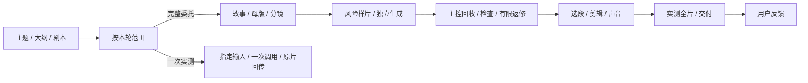

# Muse Director · Muse 导演助手

将主题、简介、大纲或剧本交给 Muse，由它统筹故事、资产、镜头生成、选用、有限返修、剪辑与声音，最后交付完整动画。普通制作决定由主控完成，用户在拿到全片后反馈。

Muse 是视频生成工具；Codex 或其他助手可辅助主控。借鉴 Seedance 文档与 Hell Grind 的分镜、参考组织和动作表达方法，不要求切换到 Seedance 模型。

## 直接给 Muse 使用

- 简单委托：[快速入口](assets/muse-quick-start.md)，包含十条规则、填好示例与最终回传格式。
- 完整制作或复杂返修：[独立制作指南](assets/muse-self-director.md)，包括能力适配、镜头设计、检查与有限恢复。

请 Muse 读取对应文件，再提供你的故事或主题；无法读取 GitHub 时，上传文件或粘贴正文。读取仓库不等于安装了原生 Skill，也不保证它具备所有执行能力。

示例：

> 按 Muse 导演助手完成一部15秒治愈二维动画：蓝外套小兔把蓝纸盒从柜台A推到B，松手微笑。9:16，无文字/Logo/水印，无对白，只要环境和动作声。没有剧本请自行设计，主控选镜、必要返修并交同一可播放可下载全片；普通选择不用逐镜问我，不超现有额度，不新增购买。

用户只要试一镜、仅一次原文实测或准备方案时，按该次范围结束，不扩成整片或额外调用。真实工具权限与资源限制仍按当前用户请求处理。

## Jarvis经验补充

新增跑动喊话、说话时转头与中文人名发音的诊断；区分原生对白和后期配音路线，保护采用声线与必要台词。加入描述语言、辅助拼音、肯定式约束及参考组合的预算内对照，并按原镜记录包括废片在内的实际生成成本。

这些来自 [Issue #1 的 Jarvis 对照评论](https://github.com/toosielu/muse-director/issues/1#issuecomment-5969265840) 的转述，尚未在本项目复现。个人经验不变成默认重试次数或速度承诺；完整委托仍自主交片，不增加逐镜审批。完整指南已同步。

本次补充验证：51项本地工具测试通过；两个离线场景新旧版本均12/12，原有核心边界均成立；skill-judge设计审查112/120（A），无阻断问题。新增的是具体诊断与统计口径，未实测Muse视频质量、声音或生成速度。

## 前次联合修订

结合 Muse 制作记录与 [Issue #1](https://github.com/toosielu/muse-director/issues/1) 的建议：

- 区分完整制作、单镜候选、原文实测与准备任务；单镜用轻量记录，完整委托继续自主交片。
- 规格门分开记录原片与最终交付；比例考虑像素比例与旋转，技术通过不等于必要动作或听感通过。
- 闪光、眨眼与快动作加密检查，每秒抽帧未见不证明全片没有，亮度峰值仅定位候选。
- 同输入复跑与改写共用原追加额度，默认每镜首版加最多一次必要追加；用户明确其他次数时仍受原镜与项目总上限约束。
- 输入检查支持纯文字、无人建立镜与连续秒段；声音、运镜、冻结约束按项目配置。
- 续接用实际取用段最后纳入帧；附件/可访问链接可回传，不强制无法提供的本地路径。
- 需要无声母版时使用实际可用后期剥离音轨，保留原片和必要台词。

来源均保留证据边界；私人文档、媒体、账号路径与生产记录不在仓库内。样本中的10秒720×1280/24fps不构成永久规格，单次失败不证明随机性。

## 文件组成

Skill 包共33个文件：入口 `SKILL.md`、16份 `references/`、9份 `assets/`、6个 `scripts/`、1份 `agents/openai.yaml`。README与.gitignore是仓库说明文件，不计入Skill。

- [SKILL.md](SKILL.md)：按任务加载参考，明确主控职责和交付范围。
- [执行范围](references/execution-modes.md)、[规格与短暂事件](references/quality-gates.md)：本次新增核心规则。
- [自主成片](references/autonomous-delivery.md)、[创作与检查](references/shot-design-checks.md)、[能力配置](references/muse-capabilities.md)、[有限诊断](references/rejection-diagnostics.md)：制作判断与边界。
- `assets/`：项目、角色卡、单镜、QA、对照及工作包模板，以及完整/快速指南。
- [本地工具说明](references/toolkit.md)：来源快照、漂移检查、文件技术/规格检查与输入检查；脚本不会调用Muse或发送消息。

助手环境将仓库目录作为 `muse-director` Skill读取即可；宿主如何安装取决于其支持方式。纯Muse使用上述指南，无需Python。

## 维护与验证

完整和快速指南从共同源生成，修改参考后分别重建，避免两种用法规则分叉：

```text
python scripts/build_muse_guide.py
python scripts/build_muse_guide.py --compact
python scripts/build_muse_guide.py --check
python scripts/build_muse_guide.py --compact --check
python -m unittest discover -s scripts -p "test_*.py"
```

前次联合修订的本地工具测试51项通过，结构检查和两份指南同步检查通过。两个新旧版本离线场景，新版12/12、旧版11/12；差异是合法纯文字/无人建立镜输入能否通过实际检查器，两版在自主决策和预算边界上均通过。另做skill-judge设计审查；这些检查不证明真实生成质量提升。尚未独立复测私人视频、连续动态、听感、Muse实际接入或跨平台使用。

成片检查分别记录技术、规格、抽帧、连续动态、听音和用户认可；缺能力保留未核验，仍在已授权范围内交完整候选。必要剧情未成立时如实交部分作品，不能用清单或静图冒充全片。


